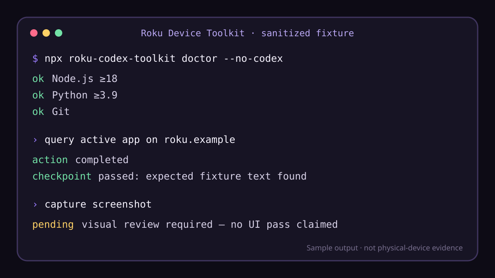
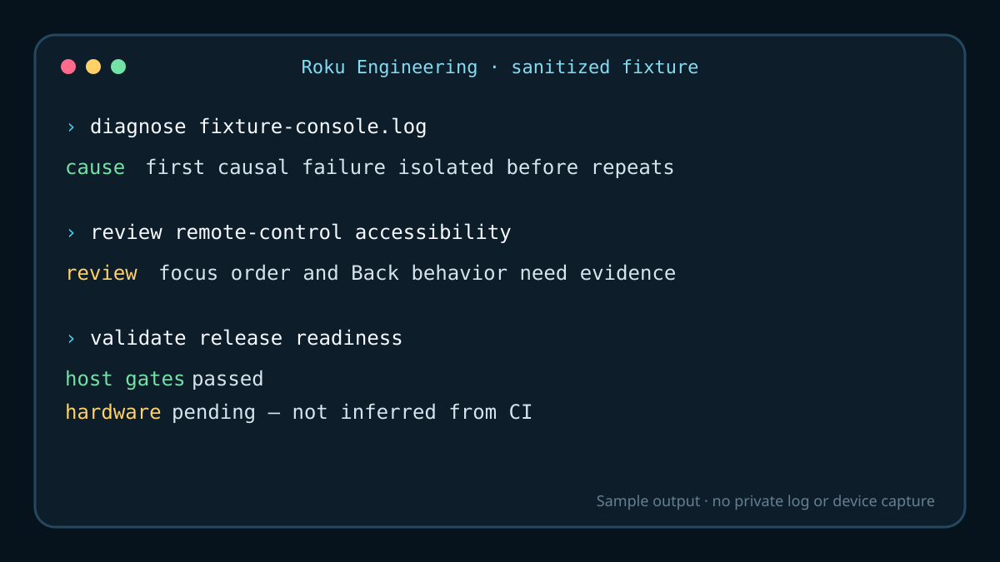

# Marketplace presentation

Roku Codex Toolkit is a project-neutral pair of Codex plugins for Roku development. It combines
bounded device automation and evidence-aware flows with repository-side diagnostics, accessibility
review, and release preparation.

Across two plugins, the toolkit currently ships five skills and 13 MCP tools.

## Choose a plugin

| Plugin | Best for | Included skills | MCP tools | Physical Roku |
| --- | --- | --- | ---: | --- |
| Roku Device Toolkit | ECP queries and controls, developer-mode operations, and repeatable flow evidence | Roku Device Operator; Roku Flow Verifier | 13 | Required for real device actions; not required for dry-run preflight |
| Roku Engineering | Runtime-log analysis, remote-control accessibility review, and release validation | Roku Runtime Log Analyzer; Roku Accessibility Reviewer; Roku Release Validator | 0 | Optional; screenshots and device evidence strengthen applicable reviews |

The plugins can be installed together but remain independently useful. Roku Device Toolkit owns the
device-facing MCP server. Roku Engineering uses skills and local scripts rather than exposing a
second MCP server.

## Capability matrix

| Capability | Roku Device Toolkit | Roku Engineering |
| --- | :---: | :---: |
| Configure a non-secret Roku target | Yes | — |
| Query device, apps, active app, and player state | Yes | — |
| Send remote keys, enter non-secret text, launch, and deep-link | Yes | — |
| Capture screenshots and bounded BrightScript console output | Yes | Analyze supplied logs |
| Confirmed development ZIP sideload | Yes | Validate release inputs |
| Run evidence-aware JSON flows | Yes | — |
| Diagnose logs and debugger output | — | Yes |
| Review SceneGraph accessibility and remote usability | — | Yes |
| Prepare and assess Roku release readiness | — | Yes |

The 13 Roku Device Toolkit MCP tools are:

`configure_target`, `configuration_status`, `device_info`, `list_apps`, `active_app`,
`player_state`, `launch`, `press`, `enter_text`, `take_screenshot`, `collect_logs`, `sideload`, and
`run_flow`.

## Requirements and evidence boundary

- Codex with plugin support
- Node.js 18 or newer
- Python 3.9 or newer
- Git for version-pinned marketplace installation
- A Roku on the same trusted local network for device operations
- Developer mode and a separately supplied developer credential for screenshots, console capture,
  and sideloading

Host CI runs on macOS, Linux, and Windows with the supported Node and Python versions. That validates
host-side portability; it does not claim physical Roku coverage from every host. A completed action
or downloaded screenshot is evidence collection, not proof that a UI or playback experience is
correct. Visual and behavioral claims require explicit checkpoints and review of the relevant
artifacts.

## Relationship to other Roku tools

Roku Codex Toolkit complements Roku Dev Studio, editor extensions, the BrightScript debugger, Roku
developer services, and the Developer Application Installer. Those tools remain the sources for
editing, language services, interactive debugging, account/channel administration, packaging, and
publishing. The toolkit adds Codex-oriented, bounded automation and evidence reporting; it does not
replace an editor, debugger, packaging toolchain, developer portal, or certification process. See
the detailed [tooling comparison](tooling-comparison.md).

## Reusable public media

The assets under [`docs/media`](media/) use fictional targets and synthetic fixture output. They
contain no device address, credential, token, private application, captured device screen, or real
console log. They are presentation examples only and must not be cited as physical-device results.

### Roku Device Toolkit

### Roku Engineering

The matching vector marks are [Roku Device Toolkit](media/roku-device-toolkit-mark.svg) and
[Roku Engineering](media/roku-engineering-mark.svg). Plugin manifests reference rasterized PNG
counterparts so Codex clients do not need SVG rendering support.
